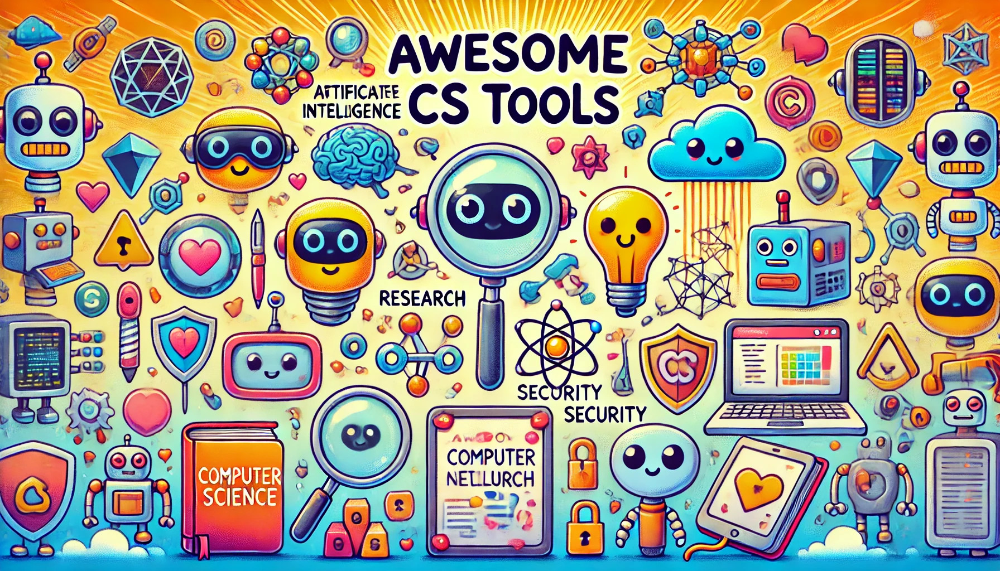

# Awesome CS Tools 

Welcome to the Awesome Computer Science Tools repository! This is a curated list of diverse tools and resources in computer science, covering areas such as Artificial Intelligence, Research, and Security. Each section includes open-source tools, free courses, and learning resources.

## Table of Contents

- [Artificial Intelligence](#artificial-intelligence)
- [Research](#research)
- [Security](#security)

## Artificial Intelligence

### Open Source Tools
- [open-llms](https://github.com/gth-ai/open-llms): These LLMs (Large Language Models) are all licensed for commercial use (e.g., Apache 2.0, MIT, OpenRAIL-M). Contributions welcome!
- [llama.cpp](https://github.com/ggerganov/llama.cpp): The main goal of `llama.cpp` is to enable LLM inference with minimal setup and state-of-the-art performance on a wide variety of hardware - locally and in the cloud.
- [xplique](https://github.com/deel-ai/xplique): 🦊 **Xplique** (pronounced *\ɛks.plik\*) is a Python toolkit dedicated to explainability. The goal of this library is to gather the state of the art of Explainable AI to help you understand your complex neural network models. Originally built for Tensorflow's model it also works for PyTorch models partially.
- [OpenMMLab](https://github.com/open-mmlab): OpenMMLab builds the most influential open-source computer vision algorithm system in the deep learning era.
- [Perplexica](https://github.com/ItzCrazyKns/Perplexica): A open-source version of Perplexity : Perplexica is an open-source AI-powered searching tool or an AI-powered search engine that goes deep into the internet to find answers. Inspired by Perplexity AI, it's an open-source option that not just searches the web but understands your questions. It uses advanced machine learning algorithms like similarity searching and embeddings to refine results and provides clear answers with sources cited.
- [Gemma.cpp Google](https://github.com/google/gemma.cpp): A lightweight, standalone C++ inference engine for the Gemma foundation models from Google.
- [Ax](https://github.com/ax-llm/ax): Build intelligent agents with ease, inspired by the power of "Agentic workflows" and the Stanford DSP paper. Seamlessly integrates with multiple LLMs and VectorDBs to build RAG pipelines or collaborative agents that can solve complex problems. Advanced features streaming validation, multi-modal DSP, etc.
- [DeepSpeed](https://github.com/microsoft/DeepSpeed): DeepSpeed empowers ChatGPT-like model training with a single click, offering 15x speedup over SOTA RLHF systems with unprecedented cost reduction at all scales.

### Free Alternative App to ChatGPT:
- [Chat-SUTRA](https://chat.two.ai/): A low-cost language model designed to master over 30 languages, including underserved South Asian languages such as Gujarati, Marathi, Tamil and Telugu.
- [HuggingFaceChat](https://huggingface.co/chat/assistants): Free alternative to GPTs of ChatGPT.
- [Gemini](https://gemini.google.com/app): Google AI ChatBot.
- [Moshi](https://us.moshi.chat/?queue_id=talktomoshi): Moshi is an experimental conversational AI. Take everything it says with a grain of salt.
- [Nomic GPT4All](https://www.nomic.ai/gpt4all): Nomic's new LLM desktop app supports thousands of LLMs.

  
### Free Courses and Resources
- [ML-YouTube-Courses](https://github.com/dair-ai/ML-YouTube-Courses): A collection of Machine Learning courses available on YouTube.
- [Prompt-Engineering-Guide](https://github.com/dair-ai/Prompt-Engineering-Guide): Prompt Engineering Guide. Prompt engineering is a relatively new discipline for developing and optimizing prompts to efficiently use language models (LMs) for a wide variety of applications and research topics.
- [deep-learning-with-python-notebooks](https://github.com/fchollet/deep-learning-with-python-notebooks): Companion Jupyter notebooks for the book "Deep Learning with Python". This repository contains Jupyter notebooks implementing the code samples found in the book Deep Learning with Python, 2nd Edition (Manning Publications).

#### For French 🇫🇷 Speakers 
- [Fondamental Deep Learning Courses](https://www.youtube.com/playlist?list=PLO_fdPEVlfKoanjvTJbIbd9V5d9Pzp8Rw): A serie of Fondamental Deep Learning courses on YouTube by Machine Learnia.
- [Deep learning course at New York University](https://lbourdois.github.io/cours-dl-nyu/): The course by Yann LE CUN (Godfather of DL) and Alfredo CANZIANI, translated into French by Loïck BOURDOIS

### Large (Language & Vision) Models
#### Tools
- [Quality Prompts](https://github.com/sarthakrastogi/quality-prompts): QualityPrompts implements 58 prompting techniques.
- [InternLM](https://github.com/InternLM/InternLM): tops open LLM leaderboard for models under 12B.
- [Awesome-LLM](https://github.com/Shubhamsaboo/awesome-llm-apps): A curated collection of awesome LLM apps built with RAG and AI agents. This repository features LLM apps that use models from OpenAI, Anthropic, Google, and even open-source models like LLaMA that you can run locally on your computer.
  
#### RAG (Retrieval-Augmented Generation)
- [Ragas](https://github.com/explodinggradients/ragas): Ragas is a framework that helps you evaluate your RAG pipelines.
- [RAGs](https://github.com/run-llama/rags): RAGs is a Streamlit app that lets you create a RAG pipeline from a data source using natural language.
- [RAGFlow](https://github.com/infiniflow/ragflow): RAGFlow is an open-source RAG engine based on deep document understanding.
- [GraphRAG](https://github.com/microsoft/graphrag): The GraphRAG project is a data pipeline and transformation suite that is designed to extract meaningful, structured data from unstructured text using the power of LLMs.

> This section was created as a tribute to my mentor, a RAG godfather.

### Research and Papers
- [ML-Papers-of-the-Week](https://github.com/dair-ai/ML-Papers-of-the-Week): A weekly list of top ML papers in your inbox.
- [Awesome Generative AI](https://github.com/aishwaryanr/awesome-generative-ai-guide): Generative AI is experiencing rapid growth, and this repository serves as a comprehensive hub for updates on generative AI research, interview materials, notebooks, and more!
- [SyntheX](https://github.com/arcadelab/SyntheX): This repository contains the training and testing scripts on the three SyntheX applications, namely hip imaging, surgical tool detection and covid. The associated data is provided in a separate folder. Detailed running instructions can be found in each sub folder.
- [awesome-object-detection](https://github.com/gth-ai/awesome-object-detection): This is a list of awesome articles about object detection.
- [Awesome Computer Vision](https://github.com/jbhuang0604/awesome-computer-vision): A curated list of awesome computer vision resources.
- [deeplearning-biology](https://github.com/hussius/deeplearning-biology): This is a list of implementations of deep learning methods to biology, originally published on Follow the Data. There is a slant towards genomics because that's the subfield that I follow most closely.
- [Awesome DeepBio](https://github.com/gokceneraslan/awesome-deepbio): A curated list of awesome deep learning applications in the field of computational biology.
  
#### Tools 
- [Medecine](https://github.com/primakov/precision-medicine-toolbox): precision-medicine-toolbox is an open-source python package for medical imaging data preparation for data science tasks. This package is aimed to provide a tool to curate the imaging data and to perform exploratory feature analysis.
- [LanguageTool](https://github.com/languagetool-org/languagetool): An Open Source proofreading software for English, Spanish, French, German, Portuguese, Polish, Dutch, and more than 20 other languages. It finds many errors that a simple spell checker cannot detect.
- [Online LaTeX diff tool](https://3142.nl/latex-diff/): An online free tool is a wrapper script for latexdiff, which is the LaTeX alternative to Track Changes in Microsoft Word. By using this tool you avoid the command line and having to install Perl. We do not keep copies of your documents.
- [doi2bib](https://www.doi2bib.org/):Give us a DOI
- [Marker](https://github.com/VikParuchuri/marker): Converts PDF to markdown quickly and accurately.
- [Nexus](https://libstc.cc/#/):Help you to found any recent paper.

#### Database
- [UC Irvine Machine Learning](https://archive.ics.uci.edu): Currently maintain 665 datasets as a service to the machine learning community.
- [paperswithcode](https://paperswithcode.com/datasets): Contains various Dataset with code and scientifs papers.
- [Kaggle Datasets](https://www.kaggle.com/datasets): Various datasets hosted by Kaggle.
- [HuggingFace🤗 Datasets](https://huggingface.co/datasets): Various datasets for Deep Learning and NLP hosted by Hugging Face.
- [re3data](https://www.re3data.org/): re3data is an online directory of research data repositories. This tool is designed to help researchers, research institutions and data managers find suitable repositories to store, share and preserve their research data.

#### HPC (High Performance Computing)
- [helpwiki sharcnet](https://helpwiki.sharcnet.ca/wiki/Online_Seminars) : Recordings of most of her webinars can be found on SHARCNET youtube channel. SHARCNET is the largest high performance computing consortium in Canada, involving 19 universities and colleges across southern, central and northern Ontario.

### ChatGPT Implementations
- [Awesome ChatGPT](https://github.com/stars/acheong08/lists/awesome-chatgpt): Awesome ChatGPT implementations.

## Dev
### Open Source Tools
- [Awesome Dev Tools](https://github.com/markodenic/web-development-resources): Awesome project about Web Development resources.
- [OpenDevin](https://github.com/OpenDevin/OpenDevin):A platform for autonomous software engineers, powered by AI and LLMs. OpenDevin agents collaborate with human developers to write code, fix bugs, and ship features.

## Security

### Open Source Tools
- [awesome-opensource-security](https://github.com/CaledoniaProject/awesome-opensource-security): A list of interesting open-source security tools, mostly reviewed and commented by me. The repo updates on a daily basis or whenever something interesting is out.

## For Computer Science Students
### Current Scholarship
#### Africa
#### Europe
#### America
Coming Soon
### Free Certifications
Coming Soon

## Contributing

We welcome contributions to this list! Please submit a pull request or open an issue to suggest additions or changes.

## License

This project is licensed under the MIT License - see the [LICENSE.md](LICENSE.md) file for details.
